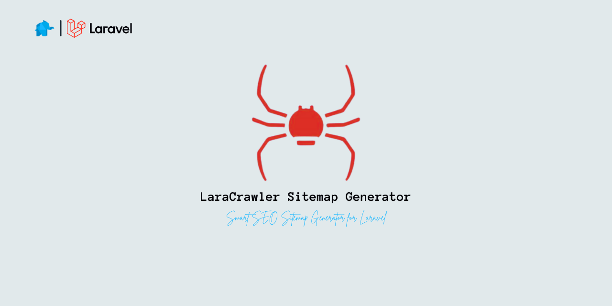

# 🚀 Laracrawler Sitemap Generator

<p align="center">
  
</p>

A powerful **Laravel sitemap generator** with crawling, validation, multilingual support, priority auto-scoring, indexability audit, and more.  
Optimized for **Google SEO best practices**.

---

## ✨ Features

-   **Recursive crawling** with depth control
-   **URL normalization** (HTTPS, trailing slashes, lowercase, strip queries/anchors)
-   **Exclusion rules** for URLs and assets (regex, extensions, substrings)
-   **Multilingual alternates (`hreflang`)** with validation
-   **Image sitemap enhancements**
    -   Extract `` + `<picture>` sources
    -   Add `<image:title>` and `<image:caption>` from `alt`/`title`
-   **Video sitemap enhancements**
    -   Extract `<video>`, `<source>`, and `<iframe>` (YouTube, Vimeo)
    -   Add `<video:title>` and `<video:description>` (defaults configurable)
-   **Priority auto-scoring**
    -   Based on crawl depth, internal link popularity, freshness
    -   Supports per-page `priority_boost`
-   **Flexible lastmod strategies**
    -   `now` → always current time
    -   `file` → file modification time
    -   `db` → fetch from database column
    -   `callback` → resolve dynamically via Closure/service
-   **Indexability audit**
    -   Detects `noindex` in headers (`X-Robots-Tag`) or meta tags
    -   Excludes such pages and logs them into `sitemap-errors.xml`
-   **Link validation**
    -   Detects broken or soft-404 links
    -   Excludes them and logs into `sitemap-errors.xml`
-   **Split & index**
    -   Auto-splits large sitemaps (`50k URLs` or `50MB` limit)
    -   Generates `sitemap-index.xml`
-   **Queue support** for async crawling in Laravel jobs
-   **Auto-ping search engines** (Google, Bing, Yandex, Baidu)
-   **Configurable HTTP client** (timeouts, SSL verify, User-Agent)

---

## ⚙️ Installation

```bash
composer require anassrojea/laracrawler
```

Publish config:

```bash
php artisan vendor:publish --tag=laracrawler-config
```

---

## 🛠️ Usage

Generate sitemap:

```bash
php artisan laracrawler:generate
```

Options:

-   `--summary` → Print summary of exclusions.
-   `--debug` → Extra debug output.
-   `--validate` → Force validation of links even if disabled in config.

---

## 📂 Configuration (`config/sitemap.php`)

### 🔗 Base settings

```php
'base_url'     => env('APP_URL', 'https://example.com'),
'xdefault'     => 'https://example.com', // <xhtml:link hreflang="x-default">
'validate_links' => false,
'max_errors'   => 5000,
```

---

### 🚫 Exclusions

```php
'exclude_urls' => [
    '/admin',
    '#\?page=\d+#', // regex pagination
    '#/search#',
    '#\.(css|js)$#',
],
'exclude_assets' => [
    '#\.(css|js|json|xml|txt|md)$#',
    '#\.(zip|rar|tar|gz|7z)$#',
],
```

---

### 🌍 Normalization

```php
'normalize' => [
    'strip_queries'       => true,
    'strip_anchors'       => true,
    'strip_trailing_slash'=> true,
    'canonicalize'        => true,   // lowercase
    'enforce_https'       => true,
    'enforce_www'         => null,   // true = add, false = strip
    'force_trailing_slash'=> false,
],
```

---

### 🌐 Multilingual

```php
'default_lang' => 'en',
'lang_mode'    => 'path', // "path", "subdomain", or "query"
'alternates'   => [
    'en' => 'https://example.com/en',
    'ar' => 'https://example.com/ar',
    'tr' => 'https://example.com/tr',
],
```

---

### 🖼 Include Rules

```php
'include' => [
    'urls'      => true,
    'images'    => true,
    'videos'    => true,
    'languages' => true,

    'rules' => [
        '#/blog#' => [
            'images' => true,
            'videos' => false,
        ],
    ],
],
```

---

### 🖼 Image Settings

```php
'image_whitelist' => [
    // '/storage/uploads/services/',
],
'image_defaults' => [
    'title'       => 'Image Title',
    'description' => 'Image Description',
],
```

---

### 🎥 Video Settings

```php
'video_whitelist' => [
    // '/storage/uploads/services/',
],
'video_defaults' => [
    'title'       => 'Video Title',
    'description' => 'Video Description',
],
```

---

### 📊 Rules (SEO Overrides)

Rules let you **override defaults per URL pattern**:

```php
'rules' => [
    '/$' => [ // homepage
        'changefreq' => 'daily',
        'priority'   => '1.0',
        'lastmod'    => 'now',
    ],

    '/blog' => [
        'changefreq'    => 'daily',
        'priority'      => '0.9',
        'priority_boost'=> 0.3, // 🚀 boost blogs slightly
        'lastmod'       => [
            'strategy' => 'db',
            'table'    => 'posts',
            'lookup'   => 'slug',
            'column'   => 'updated_at',
        ],
    ],

    '#^/(en|ar|tr)?/service#' => [
        'changefreq'    => 'weekly',
        'priority'      => null, // auto-score
        'priority_boost'=> 0.3,  // 🚀 boost services
        'lastmod'       => [
            'strategy' => 'db',
            'table'    => 'services',
            'lookup'   => 'slug',
            'column'   => 'updated_at',
        ],
    ],
],
```

-   `priority` → fixed value (`0.1`–`1.0`) or `null` for auto-score.
-   `priority_boost` → bump score (applied only if auto-score).
-   `lastmod` strategies:
    -   `"now"` → always current timestamp
    -   `"file"` → filesystem `mtime`
    -   `"db"` → fetch `updated_at` from DB
    -   `"callback"` → custom closure or service

---

### 📈 Priority Scoring

```php
'priority_scoring' => [
    'enabled'   => true,
    'weights'   => [
        'depth'     => 0.4,
        'links'     => 0.4,
        'freshness' => 0.2,
    ],
    'min' => 0.1,
    'max' => 1.0,
],
```

---

### 📡 Pinging Search Engines

```php
'ping' => true,
'ping_targets' => [
    'Google' => 'http://www.google.com/ping?sitemap=',
    'Bing'   => 'http://www.bing.com/ping?sitemap=',
    'Yandex' => 'https://webmaster.yandex.com/ping?sitemap=',
    'Baidu'  => 'http://ping.baidu.com/ping?sitemap=',
],
```

---

### 🧵 Queue Support

```php
'queue' => [
    'enabled'    => false,
    'connection' => 'default',
    'batch_size' => 100,
],
```

---

### 🌐 HTTP Client Settings

```php
'http' => [
    'validate_links' => [
        'timeout' => 10,
        'connect_timeout' => 5,
        'verify' => false,
        'http_errors' => false,
        'headers' => [
            'User-Agent' => 'LaracrawlerBot/1.0 (https://example.com)',
        ],
    ],
    'validate_alternates' => [
        'timeout' => 5,
        'connect_timeout' => 1,
        'verify' => false,
        'http_errors' => false,
        'headers' => [
            'User-Agent' => 'LaracrawlerBot/1.0 (https://example.com)',
        ],
    ],
],
```

---

### 🕵 Indexability Audit

```php
'indexability_audit' => true,
```

Flags URLs with:

-   `X-Robots-Tag: noindex`
-   `<meta name="robots" content="noindex">`

---

## 🛠 Artisan Command

```bash
php artisan laracrawler:generate     --max-depth=2     --output=public     --split     --single     --no-ping     --ping-only     --sitemap=sitemap.xml     --debug     --summary     --fresh     --queue     --validate     --audit-indexability
```

### Flags

-   `--max-depth` → set crawl depth
-   `--output` → custom output dir
-   `--split` → force multiple sitemap files
-   `--single` → force one sitemap.xml
-   `--no-ping` → skip pinging search engines
-   `--ping-only` → only ping, no crawl
-   `--sitemap` → custom sitemap name (with ping-only)
-   `--debug` → show exclusions in detail
-   `--summary` → summary of exclusions
-   `--fresh` → clear cache and recrawl
-   `--queue` → run crawl in background via jobs
-   `--validate` → enable link validation
-   `--audit-indexability` → enable noindex audit

---

## 📦 Outputs

-   `sitemap.xml` or `sitemap-index.xml`
-   `sitemap-errors.xml` (broken links, invalid alternates, noindex pages)

---

## ✅ SEO Benefits

-   Clean, canonicalized URLs only
-   Correct handling of alternates (`hreflang` + `x-default`)
-   Image metadata (`title`, `caption`)
-   Video metadata (`title`, `description`)
-   Excludes noindex & broken pages automatically
-   Auto-prioritization for deep/fresh/popular content

---

## 🔧 Best Practices

-   Always run with `--validate` in production
-   Configure `ping_targets` so Google/Bing auto-refresh faster
-   Use `priority_boost` in rules for critical pages
-   Whitelist only important image/video directories to keep sitemap lean
-   Enable `indexability_audit` to avoid indexing blocked content

---

## 📜 License

This package is open-sourced software licensed under the [MIT license](LICENSE).
